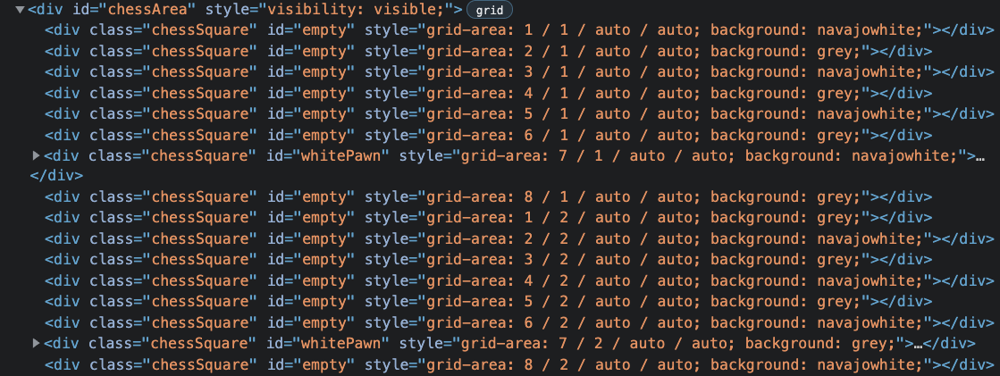

#Classic Games - Tristan Angeles

## The Repository
This repository is a personal project for Tristan Angeles to experiment with JavaScript, HTML, CSS. The product is a classic games hub to explore coding by creating classic games.

## Classic Games

  

Classic Games currently has three games with space to expand. Currently the games are Simon, Tic-Tac-Toe and Chess. Of these Simon and Tic-Tac-Toe are playable. Simon is the most finished and has integrated reset and scorekeeping functionality. Tic-Tac-Toe has ability to place player choices on the grid, but there is no win condition detection, scorekeeping or natural reset. Chess is a WIP and is at a stage where it only populates pawns for testing and has the ability to move them. 

The UI and graphics are still early phase. Functionality is prioritized and UI will be revisited in the future

## Gallery

  

  

  

## Contributing

Tristan Angeles is not looking for contributions at this time. This is a project for experimantation and skill testing. As such, there is no benefit to accepting contributions for the author.

## Feedback
Feedback is always appreciated though please keep in mind the educative nature of the project. 

## Unique bugs:

  

The original code individually added grid's column and row direction as element.gridColumn and element.gridRow. However, the DOM commands automatically change it to style.grid-area. Tristan is curious to know if there's an "easy" way to adjust this. Given the nature of what was happening, he decided to refactor the code and just use a JS 2D array that would update the element as needed and modify the id to keep the grid coordinates instead of parsing through the grid-area style data. 